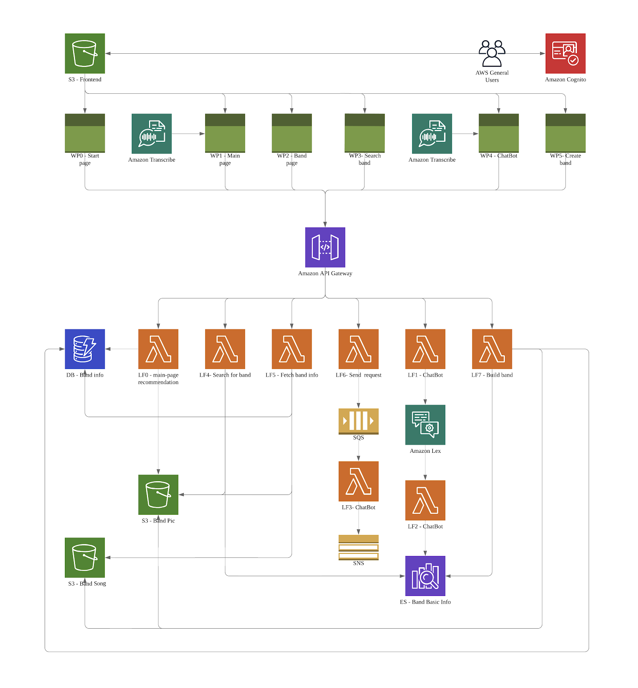

# BandUp

🎸A serverless full-stack web application for bands

BandUp is a web application designed to offer a platform for independent band lovers to team up and form a band, as well as for bands to recruit new members. It is a serverless, microservice-driven application that is completely cloud-native using Amazon Web Services (AWS)

The application leverages the Platform as a Service (PaaS) offered by core AWS services, such
as using Lambda Function as serverless compute, Dynamo DB as NoSQL document database,
S3 bucket to host the website, etc. We also utilize some of the innovative offerings from AWS
like Rekognition, Lex, Transcribe and Elastic search for some of our functionalities

**Demo:** https://youtu.be/j-6uzHuqux4

**Team Member:** 

[Andy]: https://github.com/zhmandy
[Koko]: https://github.com/tomatolike
[Aeenie]: https://github.com/XijiaoLi
[Rayleigh]: https://github.com/RayleighJin

## Architecture

****

## Implementation

We have decided to use as much Software as a Service (SaaS), Platform as a Service (PaaS) and Infrastructure as a Service (IaaS) solutions to keep costs down

***Backend.*** Since an API Server is just a function – the input is an HTTP request and the output is an HTTP response – it’s perfect for FaaS (Function as a Service) where each HTTP request gets its own server instance handling it. This setup leads to automatic scalability, high availability and reduces costs dramatically. It also makes things simpler since there are less moving parts: no servers, no load balancers, no auto-scaling groups. All these are abstracted away and all we care about is one function. Amazon Web Services (AWS) is used to host the backend API due to its free tier and our prior experience with the platform. Integration with the platform is handled by the Serverless framework. The backend API was developed using the Python3 programming language

***Frontend.*** Static website are fast, easy to scale and simple to distribute. We use AWS to host the frontend application and get fast loading times from anywhere in the world. The frontend application was created using jQuery

## Functionality

In an era when social media has become integral to people’s life, BandUp is the first one among them to provide a platform for band lovers to discover each other and team up
It allows individual musicians to

* Sign up to become a user of BandUp
* Search for a band by name, genre or the specific roles it is looking for
* View band profiles
* Stream demo music clips offered by bands
* Send request to join a band
* Get bands recommendations from the chatbot

It allows bands to

* Create a profile to recruit new members
* Upload up to 2 demos to show their taste
* Get notified receiving text messages when musicians send the join request

## User population

Our website is targeting on two kinds of user population. One is those who are clear about what kind of bands they want to join, and the other one is those who cannot articulate their needs in some keywords. Therefore, we have designed two macroscopic user flow for our website. The first type of user knows what they need, therefore they tend to use the search bar to search for bands with some keywords. The second type of user, however, tends to spend time checking our website to see if something interests them. In order to provide them with best user experience, we display some hot bands and their music demos on our main page. Users can check their profiles by just clicking the pictures. Also, we have implemented a chatbot for them to get some recommendations

## License

MIT License